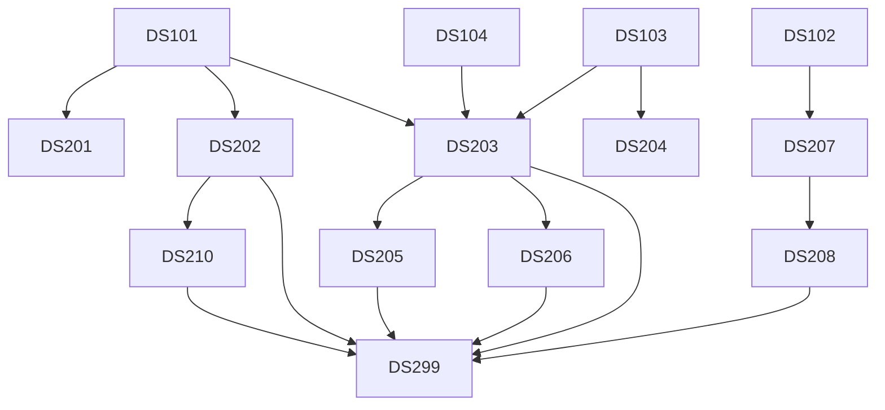

# 🎓 University of One: Master's in Data Science (6-Month Program)

## 📁 Program Overview

- **PROGRAM_TITLE:** Master's in Data Science  
- **CAREER_GOAL:** Become a job-ready, well-rounded Data Scientist with skills in machine learning, big data, time series, and research  
- **STARTING_KNOWLEDGE:** Python, SQL, Basic Machine Learning, Stats & Probability, some Calculus, DataCamp usage  
- **PROGRAM_DURATION:** 6 Months  
- **PACING:** ~14 hours per week (2 hours/day)  
- **CORE_SUBJECT_AREAS:**
  - Python for Data Science  
  - SQL for Analytics  
  - Probability, Statistics & Experimental Design  
  - Linear Algebra & Calculus Refresh  
  - Machine Learning (Supervised/Unsupervised)  
  - Data Wrangling & Regex  
  - Excel/Google Sheets  
  - Data Visualization  
  - Capstone Project

- **ELECTIVE_AREAS:**
  - Time Series Analysis  
  - Deep Learning  
  - Scientific Research & Causal Inference  
  - Data Engineering & Pipelines  
  - Big Data Tools (Hadoop, Spark)  
  - Tableau for Dashboarding

- **TEXTBOOK_RECOMMENDATIONS:**
  - *Python for Data Analysis* – Wes McKinney  
  - *An Introduction to Statistical Learning* – Gareth James  
  - *Practical Deep Learning* – Ronald T. Kneusel  
  - *Fundamentals of Data Engineering* – Joe Reis & Matt Housley  
  - *Excel Bible* – John Walkenbach  
  - *Learning Tableau* – Joshua Milligan  

- **ENHANCEMENT_OPTIONS:**
  - Career coaching check-ins every 4 weeks  
  - Weekly study/productivity hacks  
  - Resume & LinkedIn/GitHub tune-up tasks  
  - Portfolio project every week, increasing in complexity

---

## 📚 Curriculum Roadmap Table

| Course ID | Course Title                                 | Level | Type      | Prerequisites                     |
|-----------|----------------------------------------------|-------|-----------|-----------------------------------|
| DS101     | Python Foundations for Data Science          | 101   | Core      | None                              |
| DS102     | SQL for Data Exploration                     | 101   | Core      | None                              |
| DS103     | Probability & Statistics for Data Science    | 101   | Core      | Basic algebra                     |
| DS104     | Math Refresh: Calc & Linear Algebra          | 101   | Core      | Some prior exposure               |
| DS109     | Excel & Google Sheets for Data Analysis      | 101   | Core      | None                              |
| DS201     | Data Wrangling & Regex                       | 201   | Core      | DS101                             |
| DS202     | Data Visualization & Storytelling            | 201   | Core      | DS101, DS103                      |
| DS203     | Machine Learning: Supervised & Unsupervised  | 201   | Core      | DS103, DS104                      |
| DS204     | Scientific Research & Causal Inference       | 201   | Elective  | DS103                             |
| DS205     | Time Series Analysis                         | 201   | Elective  | DS203                             |
| DS206     | Deep Learning Essentials                     | 301   | Elective  | DS203, DS104                      |
| DS207     | Data Engineering & Pipelines                 | 301   | Elective  | DS101, DS102                      |
| DS208     | Big Data Tools: Hadoop & Spark               | 301   | Elective  | DS207                             |
| DS210     | Interactive Dashboards with Tableau          | 201   | Elective  | DS202                             |
| DS299     | Capstone Project: Real-World Data Science    | 401   | Capstone  | All core courses completed        |

---

## 🔗 Course Flow Diagram (Mermaid)

